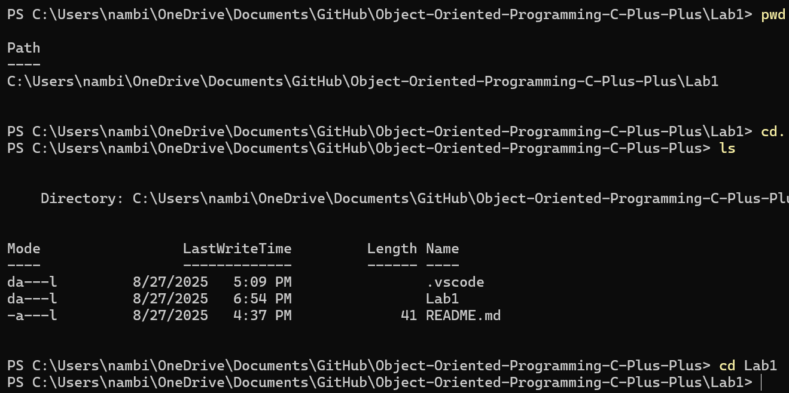
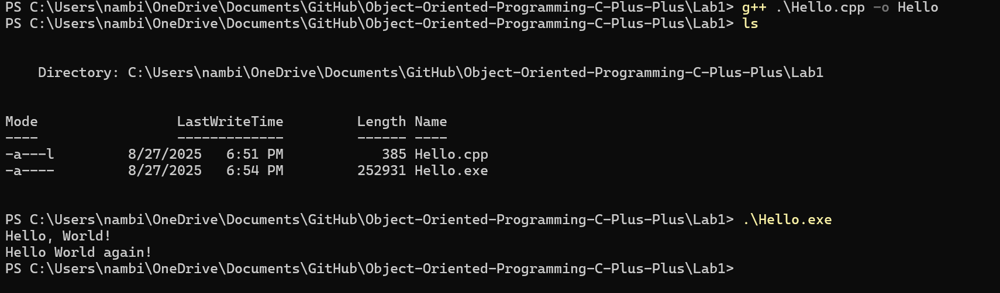
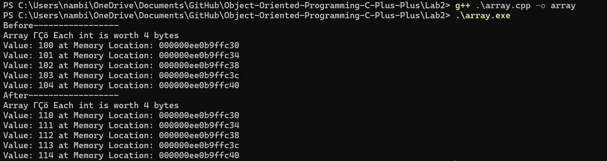
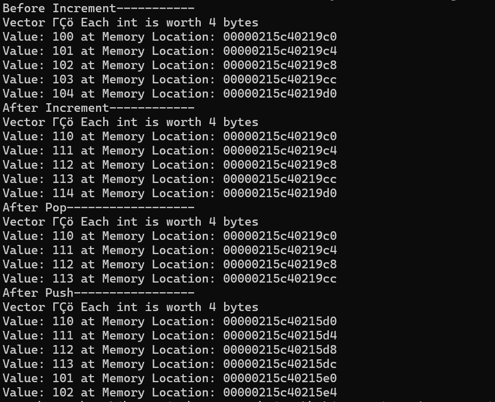
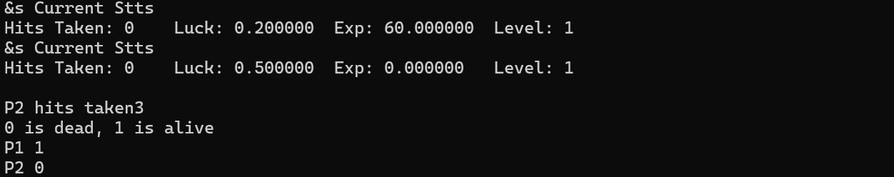
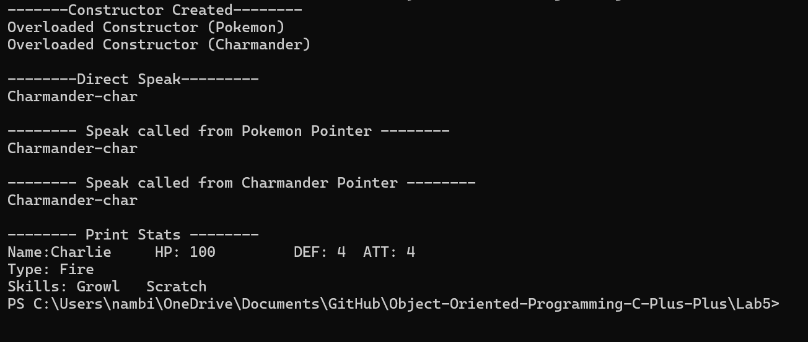
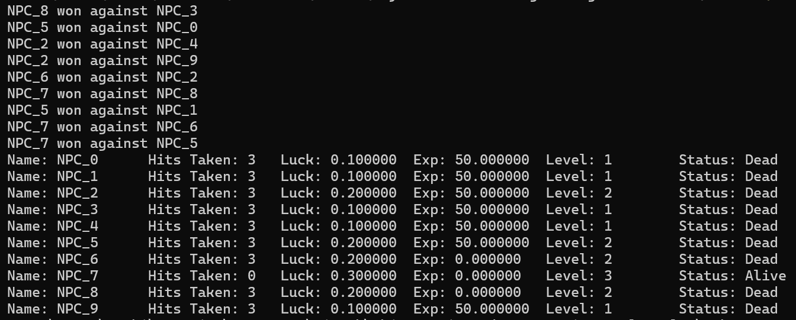

# Object-Oriented-Programming-C-Plus-Plus

## Lab 1

**Lab Folder Link:** [./Lab1/](./Lab1/)

### CLI Commands

### Program Output

## Lab 2
**Lab Folder:** ./Lab2/

### Array Output

### Vector Output

## Lab 3
**Lab Folder:** ./Lab3/

## Lab 5
**Lab Folder:** ./Lab5/

## Lab 4
**Lab Folder:** ./Lab4/

